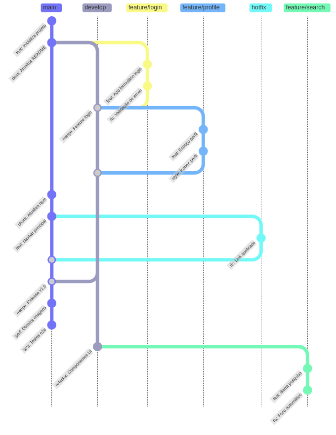
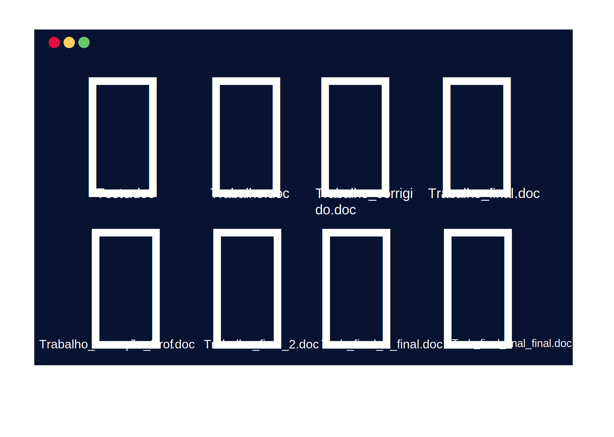
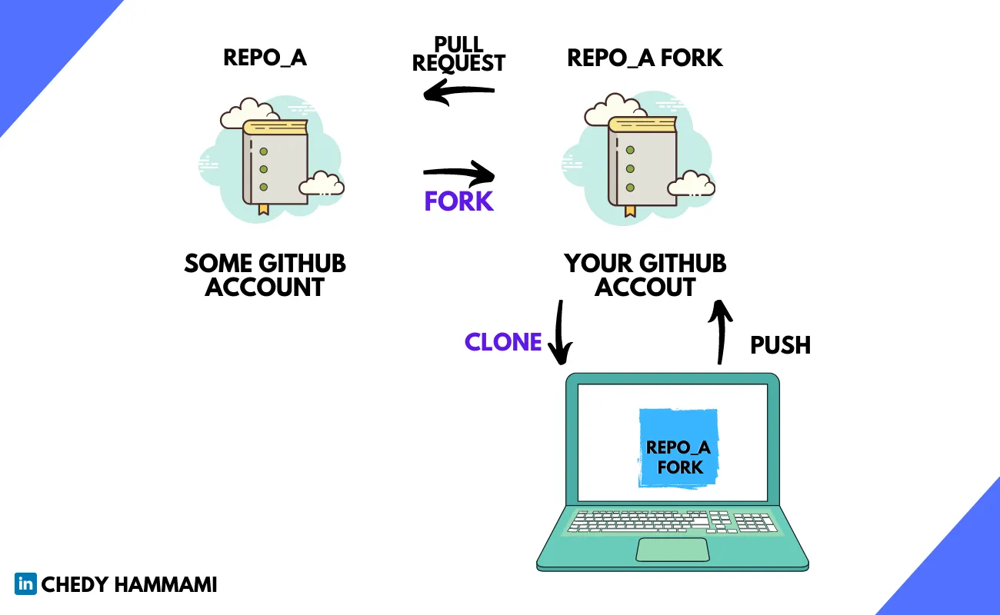
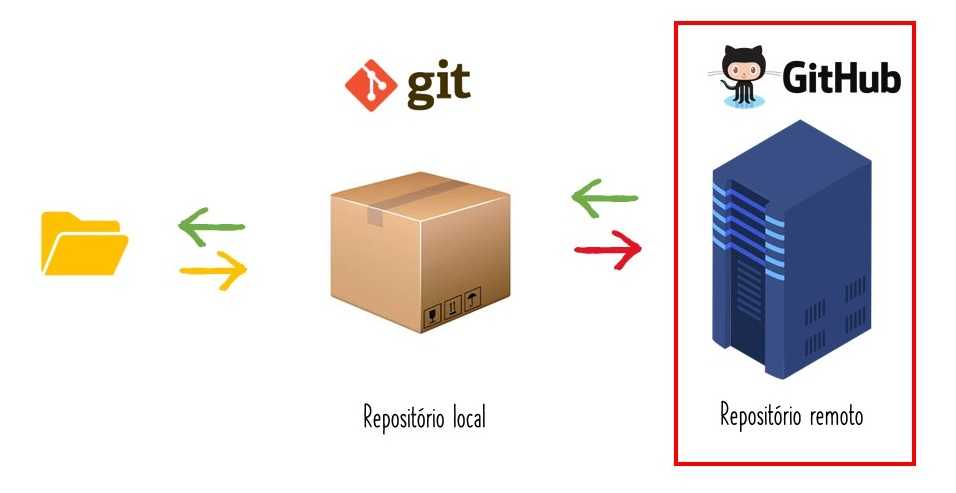
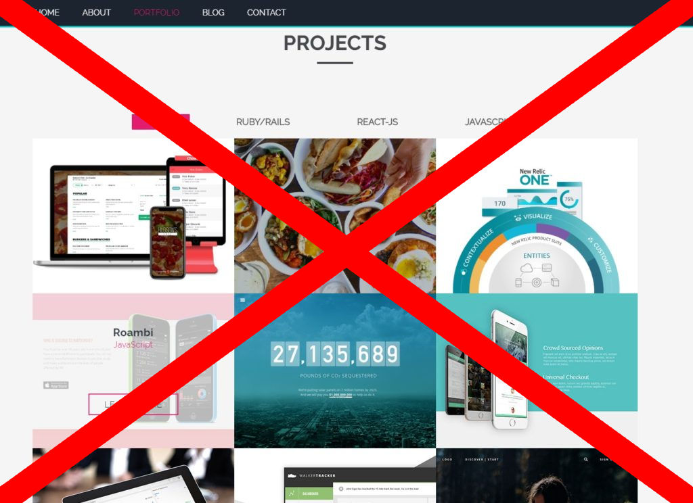
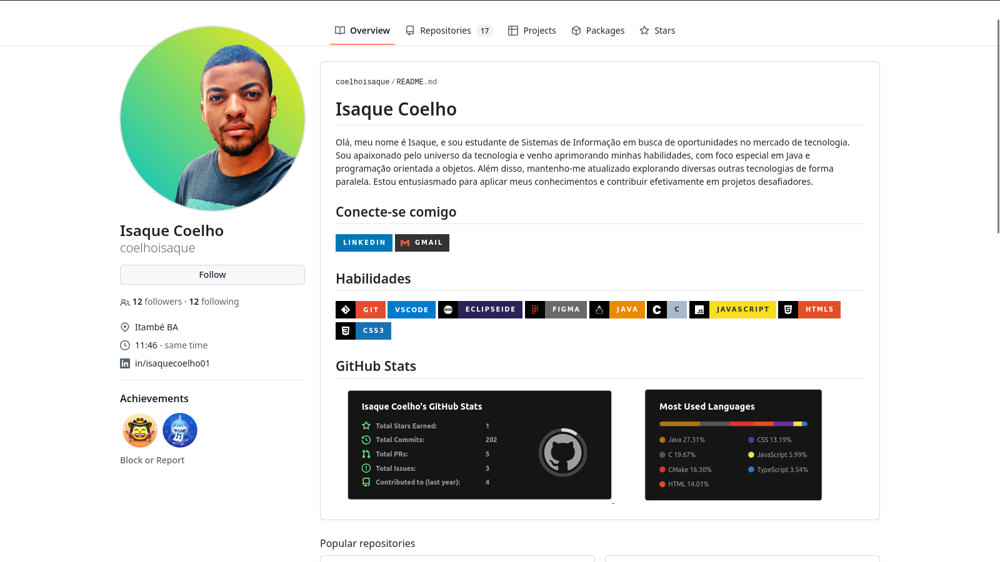
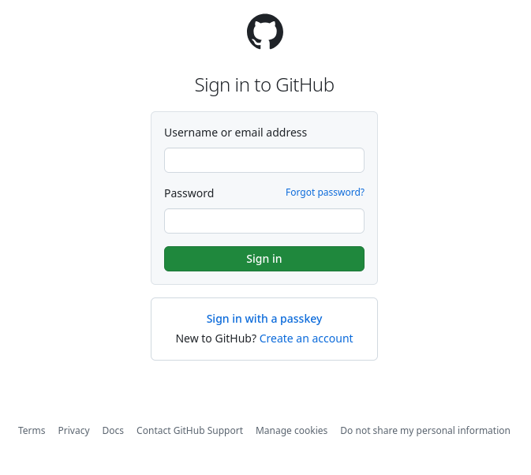

<style lang=css>
/*
Rosé Pine theme create by RAINBOWFLESH
> www.rosepinetheme.com

palette in :root
*/

@import "default";
@import "schema";
@import "structure";

:root {
    --base: #faf4ed;
    --surface: #fffaf3;
    --overlay: #f2e9e1;
    --muted: #9893a5;
    --subtle: #797593;
    --text: #575279;
    --love: #b4637a;
    --gold: #ea9d34;
    --rose: #d7827e;
    --pine: #286983;
    --foam: #56949f;
    --iris: #907aa9;
    --highlight-low: #f4ede8;
    --highlight-muted: #dfdad9;
    --highlight-high: #cecacd;

    font-family: Pier Sans, ui-sans-serif, system-ui, -apple-system,
        BlinkMacSystemFont, Segoe UI, Roboto, Helvetica Neue, Arial, Noto Sans,
        sans-serif, "Apple Color Emoji", "Segoe UI Emoji", Segoe UI Symbol,
        "Noto Color Emoji";
    font-weight: initial;

    background-color: var(--base);
}
/* Common style */
h1 {
    color: var(--rose);
    padding-bottom: 2mm;
    margin-bottom: 12mm;
    text-align: center;
}
h2 {
    color: var(--rose);
    text-align: center;
}
h3 {
    color: var(--rose);
}
h4 {
    color: var(--rose);
}
h5 {
    color: var(--rose);
}
h6 {
    color: var(--rose);
}
a {
    color: var(--iris);
}
p {
    font-size: 20pt;
    font-weight: 600;
    color: var(--text);
}
code {
    color: var(--text);
    background-color: var(--highlight-muted);
}
text {
    color: var(--text);
}
ul {
    color: var(--subtle);
}
li {
    color: var(--subtle);
}
img {
    background-color: var(--highlight-low);
}
strong {
    color: --text;
    font-weight: inherit;
    font-weight: 800;
}
mjx-container {
    color: var(--text);
}
marp-pre {
    background-color: var(--overlay);
    border-color: var(--highlight-high);
}


/* Code blok */
.hljs-comment {
    color: var(--muted);
}
.hljs-attr {
    color: var(--foam);
}
.hljs-punctuation {
    color: var(--subtle);
}
.hljs-string {
    color: var(--gold);
}
.hljs-title {
    color: var(--foam);
}
.hljs-keyword {
    color: var(--pine);
}
.hljs-variable {
    color: var(--text);
}
.hljs-literal {
    color: var(--rose);
}
.hljs-type {
    color: var(--love);
}
.hljs-number {
    color: var(--gold);
}
.hljs-built_in {
    color: var(--love);
}
.hljs-params {
    color: var(--iris);
}
.hljs-symbol {
    color: var(--foam);
}
.hljs-meta {
    color: var(--subtle);
}
.columns {
    display: flex;
    justify-content: center;
    align-items: center;
    gap: 20px;
  }
 .columns img {
    max-height: 400px;
    object-fit: contain;
  }
  .capa {
    display: flex;
    justify-content: center;
    align-items: center;
    gap: 40px;
  }
 .capa img {
    max-height: 90rem;
    object-fit: contain;
 }
 .tabela{
    align-items: center;
 }
  .grid-container {
    display: grid;
    grid-template-columns: repeat(2, 1fr);
    gap: 20px;
    align-items: center;
    text-align: center;
  }
  .grid-container img {
    max-width: 150px;
    margin: auto;
  }
  .fit{
    color: black;
  }
  .fit h1 {
    color:  var(--highlight-high);
  
  }

  .blur img {
  filter: blur(10px); /* A intensidade do borrão pode ser ajustada */
}


</style>

<div class="capa">
  <div>
       
  </div>
  <div>
     
  </div>
</div>

# Git e GitHub  
## <!-- class: middle --> Isaque Coelho

---

# O que é Controle de Versão?
<section class="centered">
<div class="columns">
  <div>
    <h3>📚 Definição</h3>
    <ul>
      <li>Sistema que registra mudanças em arquivos</li>
      <li>Histórico completo de alterações</li>
      <li>Colaboração eficiente em equipe</li>
    </ul>
  </div>
  <div>
     <div>
       
     </div>
     <div>
       
     </div>
     </div>
     <div>
           
     <div>
     <div>
       
     </div>
  </div>
</div>
</section>

---

# Sistemas de controle de versionamento – VCS

<!-- class: middle -->

<div class="columns">
  <div>

   | Centralizado (CVCS)        | Distribuído (DVCS)       |
|----------------------------|--------------------------|
| 🏦 Servidor central único   | 🌍 Cópia local completa  |
| ⚠️ Dependente de rede      | 🚀 Operações locais rápidas |
| Ex: SVN, CVS               | Ex: Git, Mercurial       |

  </div>
  <div>
     <div>
       
     </div>
     <div>
       
     </div>
     <div>
       
     </div>
    </div>
     <div>
     <div>
       
     </div>
     <div>
       
     </div>
  </div>
</div>


---

 
 
 # <!--fit--> O Que é Git? 

---

# O Que é Git?

- Git é um sistema de controle de versionamento – VCS, rápido, escalável e distribuído.
- Sistema que registra mudanças em arquivos ao longo do tempo.
- Permite voltar a versões anteriores e colaborar em equipe.
 

---

# <!-- fit --> História do Git
- Criado por Linus Torvalds em 2005 para o kernel Linux.
- Focado em velocidade, integridade e suporte a fluxos de trabalho distribuídos.

 
 
---

# Por que Usar Git?

<div class="columns">
  
  
</div>

---

#  Por que Usar Git?

<div class="columns"> 
<div>

## Benefícios do Git
- **Controle de Versionamento:** Rastreia todas as alterações.
- **Distribuído:** Cada desenvolvedor tem uma cópia completa.
- **Rápido:** Operações locais são instantâneas.
- **Flexível:** Suporta múltiplos fluxos de trabalho.
  
 </div> 
  

</div>


---

# Instando o Git
### Instalando o Git
- **Windows:** Baixe o instalador no site oficial.
- **Linux:** `sudo apt install git`
- **macOS:** `brew install git`

---

# Configuração Inicial
```bash
git config --global user.name "Seu Nome"
git config --global user.email "seuemail@example.com"                       
```

---

# ⚠ Controle de Versão Local  

O Git não depende de um servidor remoto.  
Você pode hospedar seus repositórios localmente.  

### 🔄 Tipos de Controle de Versão:  
- **Centralizado** (CVCS) 🏢: Um único servidor armazena o código-fonte, e os usuários fazem checkout das versões.  
- **Distribuído** (DVCS) 🌍: Cada usuário possui uma cópia completa do repositório, permitindo trabalho offline e maior segurança.  


---

# Conceitos Fundamentais

<div class="columns">
<div> 

**Repositório**
Local onde o Git armazena o histórico de alterações.

**Commit**
Snapshot das alterações feitas no código.

</div>


</div>
</div>

---

# Conceitos Fundamentais

<div class="columns">

<div>

**Branch**

<p>Uma linha separada para desenvolver novas funcionalidades sem afetar o código principal.</p>


</div>

<div>

**Merge**

<p>Une as mudanças feitas em uma branch ao repositório principal, mantendo o histórico organizado.</p>


</div>

</div>

---

# Conceitos Fundamentais

**Clone**
Copia um repositório remoto para sua máquina local.
**Fork**
cria uma cópia de um repositório no GitHub para contribuição

 <div class="columns" >

  <div>   </div>
  <div> </div> </div>
  
 </div>


---

# Comandos Essenciais

```bash
git init                        # Inicializa um novo repositório
git clone URL                   # Clona um repositório remoto
git status                      # Verifica o estado do repositório
git add arquivo                 # Adiciona arquivos ao staging area
git commit -m "Mensagem"        # Salva as alterações
git log                         # Visualiza o histórico de commits          
```

---

# Trabalhando com Branches
```bash
git branch nome-branch              # Cria uma nova branch
git checkout nome-branch            # Alterna para a branch
git switch nome-branch              # Alternativa moderna
git merge nome-branch               # Mescla branches                       
```

---

# Colaboração e Trabalho em Equipe
```bash
git remote add origin URL          # Adiciona um repositório remoto          
git push origin main               # Envia alterações para o remoto
git pull origin main               # Atualiza o repositório local
git fetch                          # Busca alterações sem mesclar
```

---

#  O Que é GitHub?

 <div class="columns">
  
 </div>


---

#  O Que é GitHub?

 <div class="columns">
  
 </div>


## Seu portfólio web

---

#  O Que é GitHub?

<div class="columns">
  
 </div>

## Seu portfólio web 

---

#  O Que é GitHub?

<div class="columns">
  
 </div>


## Seu portiffolio web com **Código**

---


### Preparação

- Registre uma conta no [GitHub](http://github.com)
- Escolha um editor (vim, gedit, vscode)


  
---

# Configuração do ambiente

- Defina seu nome e e-mail para associar corretamente seus commits.  
- O parâmetro `--global` aplica a configuração a todos os repositórios do usuário.  

```bash
git config --global user.name "Seu Nome"
git config --global user.email "seuemail@example.com"
```

---

# O Arquivo `.gitconfig`

- As configurações globais são salvas no arquivo `~/.gitconfig`.  
- Para definir configurações apenas para um repositório específico, remova `--global`.  
- Para visualizar as configurações atuais:  

```bash
git config --list
```
---

# GitHub Essentials  
📌 O que é o GitHub?  
- 🐙 Plataforma de hospedagem de código  
- 🤝 Ferramentas de colaboração  
- 🔄 Integração contínua com Git  

💡 **Conectando um repositório remoto**  
```bash
# Adicionar remote
git remote add origin https://github.com/user/repo.git

# Enviar código para o repositório remoto
git push -u origin main
```

---

# Gerenciando Repositórios Remotos  
🔗 **Comandos úteis para manipular repositórios remotos**  
```bash
# Verificar os remotes configurados
git remote
git remote -v

# Exibir detalhes sobre um remote específico
git remote show origin
```

🛠️ **Dicas:**  
- Sempre confira os remotes antes de fazer um `push` para evitar erros.  
- Use `git remote show origin` para visualizar detalhes como URLs e branches de rastreamento.  


---

# README.md

[Markdown Cheatsheet](https://github.com/adam-p/markdown-here/wiki/Markdown-Cheatsheet)  
[Mastering Markdown](https://guides.github.com/features/mastering-markdown/)

---

# .gitignore

[Coleção de modelos úteis .gitignore](https://github.com/github/gitignore)  
[Git Large File Storage](https://git-lfs.github.com/)

---


<div class="fit">


# <!--fit-->  Quando fazer commit?


  


---

# Boas Práticas de Commit 
✅ **Dicas para commits eficientes**  
- ✨ **Commits atômicos** (pequenas mudanças independentes)  
- 📝 **Mensagens claras** (título com até 50 caracteres)  
- 🔍 Seguir a convenção [**Conventional Commits**](https://www.conventionalcommits.org/)  

📌 **Exemplos de commits bem escritos:**  
```bash
feat: adiciona autenticação OAuth
fix: corrige timeout na API
docs: atualiza guia de instalação
```

---

# Gerenciando Arquivos no Git   
📌 **Removendo arquivos do repositório**  
```bash
# Apagar arquivo do repositório e do sistema
git rm <arquivo>

# Parar de rastrear um arquivo sem removê-lo do sistema
git rm --cached <arquivo>
```

📌 **Renomeando arquivos no Git**  
```bash
git mv <arquivo_antigo> <arquivo_novo>
```

---

# Resetando para uma Versão Anterior   
🚀 **Desfazendo alterações com `git reset`**  
```bash
# Resetar para uma revisão específica, mantendo alterações locais
git reset <revisão>

# Resetar completamente (perdendo todas as mudanças locais)
git reset --hard <revisão>
```

⚠️ **Atenção:**  
- O `git reset --hard` **apaga mudanças não commitadas**, use com cuidado!  
- Para desfazer commits sem perder arquivos, prefira `git reset <revisão>`.  


---

# [Gerando chaves SSH](https://help.github.com/articles/generating-ssh-keys)

1. Abra Terminal.

2. Cole o texto abaixo, substituindo o email usado no exemplo pelo seu endereço de email do GitHub.

```bash 
ssh-keygen -t ed25519 -C "your_email@example.com" 
```

> 🛈 Note 
>
> Se estiver usando um sistema herdado que não dá suporte ao algoritmo Ed25519, use:
>
> ssh-keygen -t rsa -b 4096 -C "your_email@example.com"


---

# [GitHub Pages](http://pages.github.com/)
 
---

# [Git Flow](http://nvie.com/posts/a-successful-git-branching-model/)

## Um modelo de branching bem-sucedido

- Criado por Vincent Driessen. Ele define uma estrutura organizada para o desenvolvimento de software, baseada em diferentes tipos de branches, facilitando a colaboração e a entrega de versões.


---

# Investigando Alterações com `git blame`

🔎 **Descubra quem editou cada linha de um arquivo**  

```bash
git blame <caminho-do-arquivo>
```

📌 **O que `git blame` faz?**  
- Exibe o **autor**, o **commit** e a **data** de cada linha do arquivo.  
- Útil para rastrear mudanças e entender o histórico do código.  

> ⚠️ **Dica:** Combine com `grep` para buscar palavras específicas:  
> ```bash
> git blame <arquivo> | grep "função_importante"
> ```

---

# Hospedando um servidor Git

<div class="grid-container">
  <div>

  <a href="https://git-scm.com/book/en/v2/Git-on-the-Server-Getting-Git-on-a-Server">Repositório bare</a>
  <a href="https://about.gitlab.com/">GitLab</a>
  <a href="https://gitea.io/">Gitea</a>
  <a href="http://gogs.io/">Gogs</a>
   
  </div>
<div>
  <div>
    
  </div>
  <div>
    
  </div>
</div>
<div>
  <div>
    
  </div>
  <div>
    
  </div>
</div>

  <div>
    
  </div>

</div>

---

# Resumo:

<div class="columns">
<div>

## Principais Conceitos
- 📚 Versionamento distribuído
- 🧩 Commits atômicos
- 🌿 Branching estratégico
- 🤝 Colaboração via GitHub

</div>
<div>


## Boas Práticas
- 📝 Mensagens claras
- 🔄 Fluxo de trabalho definido
- 📚 Documentação
- 🧹 Mantenha o repositório limpo

</div>
</div>

---

<!-- Final Slide -->


<div class="columns">

<div>

### Contato:
🔗 [LinkedIn: isaquecoelho01](www.linkedin.com/in/isaquecoelho01)  
🐙 [GitHub: coelhoisaque](https://github.com/coelhoisaque)  

</div>
</div>

<br><br><br>

---

<!-- _class: biblio -->

# Referências

- CHACON, S.; STRAUB, B. **Pro Git**. 2. ed. Berlim, Alemanha: APress, 2014.

- **Documentação oficial do Git**. Disponível em: <https://git-scm.com/doc>. Acesso em: 19 fev. 2025.

- **Git Cheatsheet**. Disponível em: <https://ndpsoftware.com/git-cheatsheet.html>. Acesso em: 19 fev. 2025.

---

- **Kit de Treinamento GitHub**. Disponível em: <https://training.github.com/downloads/pt_BR/github-git-cheat-sheet/>. Acesso em: 20 fev. 2025.

- **notFinal.doc**. Disponível em: <https://phdcomics.com/comics.php?f=1531>. Acesso em: 19 fev. 2025.

---

# Dicas 

- [Oh Shit, Git!](https://ohshitgit.com/pt_br/swears/) (dicas rápidas de emergência)
- [Git Explorer](https://git.gaozih.com/) (busca interativa de comandos)
- [GitHub Skills](https://skills.github.com) (treinamentos interativos)
- [Git Immersion](https://gitimmersion.com) (imersão prática em Git)

